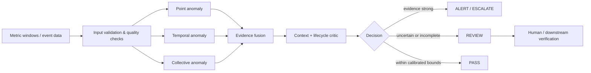

# Black Swan — back_swan

[](https://colab.research.google.com/github/narongdetpyou-ux/back_swan/blob/main/notebooks/quickstart.ipynb)

**รุ่นหลัก: Logic v8 / สถานะ: research prototype สำหรับ anomaly triage และ decision support**

โครงการนี้คำนวณหลักฐานจาก metric windows, ตรวจข้อมูลและ context, ส่ง REVIEW เมื่อข้อมูลไม่พอ และมี runtime แยก process เพื่อควบคุมงานค้าง ไม่ใช่ LLM ที่ฝึกใหม่ และยังไม่ผ่าน production real-data/long-duration load validation

## สถานะปัจจุบัน

| ส่วนงาน | สถานะ |
|---|---|
| Logic v8 source/runtime | Canonical research implementation; ยังไม่เปลี่ยน decision logic ในรอบอัปเดตนี้ |
| Phase 1 — Dataset Contract | **COMPLETE** — validator, fixtures, tests และ CI ผ่าน |
| Phase 2 — Experiment & Attack Scenario Contract | **CRITERIA READY / EXECUTION NOT STARTED** |
| Phase 3 — Blind Real-World Evaluation | **NOT STARTED** |
| Full repository regression | **85/85 ผ่าน** บน repository refresh CI run 35502747378 |
| Production readiness | **NOT READY** — ยังไม่มี admitted real/controlled telemetry สำหรับ Phase 2 และยังไม่ผ่าน end-to-end production validation |

เอกสารเกณฑ์: [Phase 1](docs/REAL_WORLD_VALIDATION_PHASE1.md) · [Phase 2](docs/REAL_WORLD_VALIDATION_PHASE2.md) · [สถานะโครงการ](PROJECT_STATUS.md)

## Data flow



แผนภาพนี้แสดงเส้นทางหลักของ Logic v8: รับ metric windows → ตรวจคุณภาพ → คำนวณหลักฐาน 3 ช่องทาง → รวมหลักฐาน → ตรวจ context/lifecycle → ส่งผล PASS, REVIEW หรือ ALERT/ESCALATE

## เริ่มใช้งาน

ใช้ Python **3.12 บน Linux** ซึ่งเป็นสภาพแวดล้อมที่ทดสอบแล้ว Runtime ไม่มี dependency ภายนอกและไม่ต้องใช้ API key

จากโฟลเดอร์ repository:

```bash
python3 scripts/run_checks.py
python3 benchmarks/evaluate_black_swan_v8.py --skip-load
```

คำสั่งแรกตรวจไฟล์และรัน tests v7 + v8; คำสั่งที่สองประเมิน correctness, microbenchmark และ fault handling ใช้ข้อมูลสังเคราะห์ ผลใหม่บันทึกใน `experiments/local/<run_id>/` และไม่เขียนทับผลเดิม

ติดตั้ง package แบบ local ได้เมื่อมี setuptools อยู่แล้ว:

```bash
python3 -m pip --disable-pip-version-check install --no-index --no-deps --no-build-isolation -e .
```

```python
from black_swan import BlackSwanV8, Calibration, ScenarioInput, IsolatedDecisionPool
```

ชื่อ repository ยังคง `back_swan`; ชื่อ Python package คือ `black_swan` ค่า calibration ที่มาจาก benchmark ใช้กับข้อมูลจำลองเท่านั้น ไม่ใช่ค่าที่รับรองสำหรับข้อมูลจริง

## ไฟล์หลัก

| ตำแหน่ง | เนื้อหา |
|---|---|
| `src/black_swan/engine.py` | Engine v8 ที่กู้จากชุด verified เดิม; แก้เฉพาะการจัด module/import |
| `src/black_swan/runtime.py` | Runtime ที่มี queue, watchdog, cancellation และ worker isolation |
| `src/black_swan_v7_engine.py` | Reference math v7 ที่ v8 ใช้ร่วมกัน; bytes เดิม |
| `tests/` | 85 test methods: v7 9, v8 24, Colab 25, archive 8, workflow 13 และ Phase 1 contract 6 |
| `benchmarks/` | เครื่องมือประเมินคุณภาพ ความเร็ว และโหลด |
| `configs/` | Manifest การสอบเทียบเดิม |
| `data/` | ข้อมูลต้นทางที่กู้ได้, provenance และกติกาการแบ่งชุด |
| `experiments/` | ผลรันแต่ละชุดที่มีชื่อไม่ซ้ำ |
| `reports/` | รายงานตรวจสอบและผลแต่ละรุ่น |
| `archive/releases/` | ZIP เดิมที่เก็บไว้ตรวจย้อนกลับ |
| `docs/` | Contract, Phase 1/Phase 2, วิธีเก็บข้อมูล และสถานะ credential |
| `notebooks/quickstart.ipynb` | Quickstart สำหรับเปิดใน Colab และทดลอง Logic Anomaly Detection |

## ผลเดิมและข้อจำกัด

ผล v8 เดิมอยู่ใน [รายงาน v8](reports/v8/v8_validation_report_th.md) และ [JSON เดิม](experiments/20260904T033307Z_v8_original/results.json) โค้ด 4 ไฟล์ใน ZIP ตรงกับ hashes ใน JSON ก่อนจัดโครงสร้าง ฟังก์ชันและ class ของ engine/runtime และ test classes ทั้ง 24 รายการคง AST เดิมหลังจัด module

ผลดีบนข้อมูลสังเคราะห์ไม่รับรองการตรวจ zero-day ทุกชนิด ความเร็ว compute ไม่ใช่เวลาตั้งแต่เกิดเหตุจนตรวจพบ และยังไม่ผ่านเป้าหมาย 10,000–20,000 full decisions/s ในระบบจริง อ่าน [PROJECT_STATUS.md](PROJECT_STATUS.md) ก่อนใช้ผลเป็นข้ออ้างด้านประสิทธิภาพ

## การประเมินโหลด

```bash
python3 benchmarks/evaluate_black_swan_v8.py --load-only
```

อ่าน achieved offer rate, computed throughput, fallback และ emitter lag แยกกัน การตั้งเป้า 10,000/s ไม่ได้แปลว่าตัวสร้างโหลดส่งได้ตามนั้น การประเมินนี้เป็น local runtime ไม่มี production network/storage/authorization

## ชุดสำรองที่ไม่รวม secrets

```bash
python3 scripts/export_snapshot.py --output backups/black_swan_snapshot.zip
```

ZIP นี้รวม current files และ checksums; ไม่รวม `.git`, credentials, private data, local runs หรือ backup ซ้อนกัน เก็บสำเนาไว้ในพื้นที่ส่วนตัวอีกแห่งหนึ่งและเก็บข้อมูล/ผลที่อยู่ภายนอกตาม manifest ด้วย ดู [วิธีจัดเก็บ](docs/DATA_STORAGE.md)

ได้ไฟล์ `.zip.sha256` อัตโนมัติด้วย ตรวจและกู้ด้วย `scripts/verify_snapshot.py` ทุก run ใหม่สร้าง `manifest.json` พร้อมสถานะ เวลา source/result hashes และคำสั่งที่ใช้ อ่าน [กติกาตั้งชื่อและบันทึก run](docs/EXPERIMENTS.md) และ [mapping ตำแหน่งเก็บไฟล์](configs/storage_policy.json) ก่อนเพิ่ม dataset หรือ baseline ใหม่

## Credential ที่ต้องติดตาม

วันที่ 20 กันยายน 2026 ได้ลบ path ของ key เดิมออกจากประวัติ `main` ด้วย one-time history rewrite และตรวจผ่าน GitHub API ว่าไม่พบ path ดังกล่าวใน current tree หรือ commit query แล้ว อย่างไรก็ตาม repository ไม่สามารถยืนยันการ revoke/rotate ที่บัญชีผู้ให้บริการต้นทาง และไม่สามารถลบสำเนาที่เคย clone/fork/cache ไว้นอก repository ได้ อ่าน [SECURITY_STATUS.md](docs/SECURITY_STATUS.md) ก่อนเปลี่ยน repository เป็น public หรือถือว่า incident ปิดสมบูรณ์
